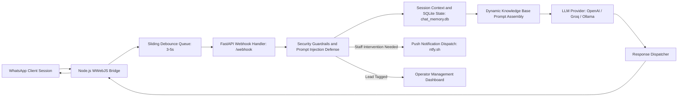

# hospitality-ai-agent

Autonomous WhatsApp conversational agent, moderation gateway, and live management console for hospitality accommodation inquiries.

## Overview

WhatsApp Camp Bot POC is an autonomous communication service designed for campground and hospitality operators. It connects WhatsApp Web client instances with an asynchronous Python FastAPI backend, aggregates rapid fragmented incoming messages using a sliding debounce buffer, validates inputs against prompt injection and scope guardrails, evaluates customer reservation intent, and dispatches LLM-generated responses while maintaining live oversight via a local browser console.

## Architecture and Pipeline

The application decouples WhatsApp protocol interaction from business logic using a dual-process architecture.



- Ingestion Layer: A Node.js service running `whatsapp-web.js` maintains headless browser sessions via Chromium, receiving inbound messages via WebSocket events.
- Debounce Aggregation: Messages arriving in rapid succession from the same user are buffered in memory for 3 to 5 seconds to merge multi-part messages into a single conversational turn.
- Security Filter: The Python backend validates payloads for token length, injection patterns, repetitive loops, and blacklisted input tokens before query assembly.
- Context Assembly: System instructions pull accommodation pricing, curfew rules, amenity details, and check-in policies dynamically from local persistent storage or markdown knowledge files.
- Model Inference: Inquiries route to configured cloud providers (OpenAI, Groq, Gemini) or a local Ollama instance with fallback timeout handling.
- Intervention & Alerts: High-urgency inquiries or user-requested agent handoffs trigger automated push notifications via `ntfy.sh` and toggle human-override flags in the database.

## Tech Stack

| Component | Technology | Description |
| :--- | :--- | :--- |
| Backend Framework | Python 3.10+, FastAPI, Uvicorn | Asynchronous HTTP server and REST endpoints |
| Protocol Bridge | Node.js 18+, whatsapp-web.js | WhatsApp Web protocol driver and session keeper |
| Persistence | SQLite3 (WAL mode) | Local relational storage for turns, leads, and configuration |
| Network Client | HTTPX | Asynchronous API client for external model providers |
| Guardrails / Validation | Pydantic v2, Regex | Input validation and intent classification rules |
| Operator Interface | HTML5, Vanilla JavaScript, CSS3 | Single-page monitoring dashboard and live chat hub |

## Project Structure

```text
whatsapp-camp-bot-poc/
├── .env.example              # Configuration environment template
├── .gitignore                # Source control ignore rules
├── README.md                 # Technical documentation
├── DEPLOYMENT.md             # Server deployment specifications
├── docker-compose.yml        # Container composition (bridge + backend)
├── requirements.txt          # Python dependency manifest
├── backend/                  # Python core service
│   ├── main.py               # FastAPI entrypoint, webhook and API routes
│   ├── config.py             # Configuration loader and environment bindings
│   ├── security.py           # Guardrails, rate limits, and injection defense
│   ├── notifier.py           # Notification dispatcher (ntfy integration)
│   ├── camp_knowledge.txt    # Base operational knowledge file
│   ├── requirements.txt      # Backend package manifest
│   └── test_backend.py       # Automated unit test suite
├── bridge/                   # Node.js communication bridge
│   ├── package.json          # Node dependencies (whatsapp-web.js, qrcode)
│   └── index.js              # Session listener and HTTP dispatcher
├── frontend/                 # Management web UI
│   ├── index.html            # Operator console and prompt editor
│   └── app.js                # Live polling, session controls, and chat feed
├── scripts/                  # Diagnostics, health checks, and sync scripts
├── start_all.bat             # Simultaneous local startup script
└── stop_all.bat              # Process termination utility
```

## Setup and Prerequisites

### Prerequisites
- Python 3.10 or higher
- Node.js 18 or higher (with npm)
- Google Chrome or Chromium installed (required by Puppeteer)

### Installation

1. Navigate to the project root:
   ```bash
   cd c:/Tools/whatsapp-camp-bot-poc
   ```

2. Configure Python environment:
   ```bash
   python -m venv .venv
   .venv\Scripts\activate
   pip install -r requirements.txt
   ```

3. Install Node.js bridge dependencies:
   ```bash
   cd bridge
   npm install
   cd ..
   ```

4. Configure environment variables:
   ```bash
   copy .env.example .env
   ```

5. Set your LLM provider credentials in `.env`:
   ```ini
   LLM_PROVIDER=openai
   LLM_API_KEY=your_api_key_here
   LLM_MODEL=gpt-4o-mini
   ```

## Usage Examples

### Starting Local Services
To start both backend and bridge instances concurrently on Windows:
```bash
start_all.bat
```

Alternatively, run services independently in separate terminals:

Terminal 1 (Python Backend):
```bash
python -m uvicorn backend.main:app --host 0.0.0.0 --port 8000
```

Terminal 2 (Node.js WhatsApp Bridge):
```bash
cd bridge
node index.js
```

### Accessing the Management Console
Open your browser and navigate to:
```text
http://127.0.0.1:8000/
```
Scan the terminal QR code or use the web dashboard to pair your WhatsApp session via 8-digit pairing code.

### Running Test Verification
Execute test scenarios:
```bash
pytest backend/test_backend.py
```

### Core Configuration Parameters

| Variable | Default Value | Description |
| :--- | :--- | :--- |
| `HOST` | `0.0.0.0` | IP address binding for backend server |
| `PORT` | `8000` | Port for backend server |
| `DATABASE_PATH` | `chat_memory.db` | Path to local SQLite storage file |
| `LLM_PROVIDER` | `openai` | Active provider: `openai`, `groq`, `ollama` |
| `LLM_API_KEY` | None | API authentication key |
| `LLM_MODEL` | `gpt-4o-mini` | Target language model |
| `RATE_LIMIT_PER_MINUTE`| `5` | Inbound rate limit cap per telephone number |

## Notes and Constraints

- WhatsApp Web Session Persistence: Credentials are stored under `.wwebjs_auth`. Do not commit or share this directory; deleting it requires re-pairing via QR or code.
- Concurrency Limits: Rate limits restrict incoming messages to 5 requests per minute per phone number to mitigate spam and accidental loop conditions.
- SQLite Concurrency: Local storage operates in WAL mode with a 5-second busy timeout to safely accommodate simultaneous reads from the dashboard and writes from webhook workers.
